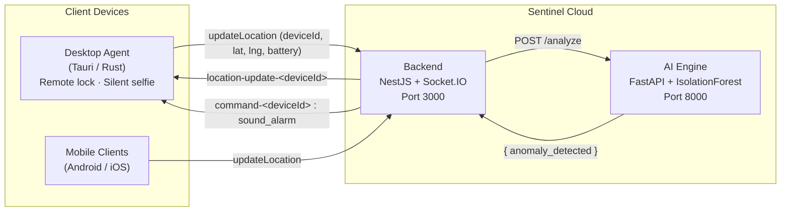
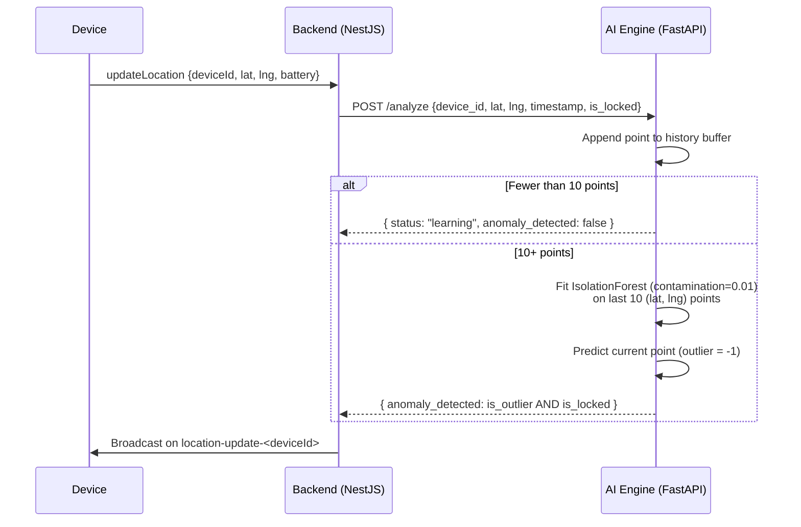
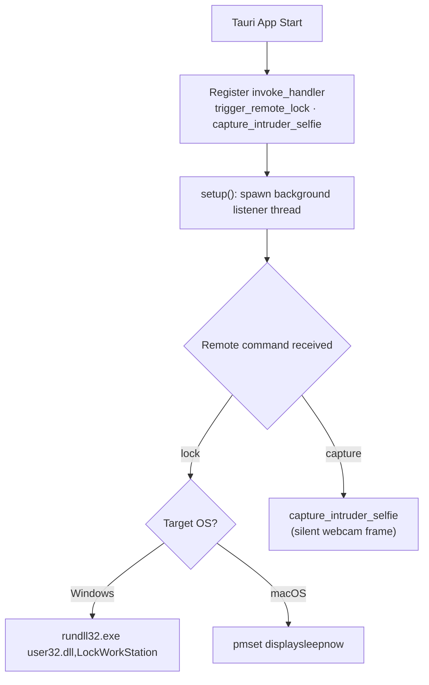

# Sentinel Anti Theft

A multi-component anti-theft and device-tracking platform combining a real-time WebSocket command backend, a machine-learning anomaly detection engine, and a stealth desktop agent capable of remote locking and silent camera capture.


## 📑 Table of Contents

- [Overview](#-overview)
- [Features](#-features)
- [Architecture / How It Works](#-architecture--how-it-works)
- [Repository Structure](#-repository-structure)
- [Prerequisites](#-prerequisites)
- [Installation](#-installation)
- [Usage](#-usage)
- [Running with Docker](#-running-with-docker)
- [Contributing](#-contributing)
- [License](#-license)

## 🚀 Overview

**Sentinel Anti Theft** is a distributed security platform designed to protect laptops and mobile devices against theft. Devices stream live GPS coordinates over WebSockets to a central **NestJS backend**, which broadcasts updates to dashboards and relays remote commands (such as sounding an alarm) back to devices. A **FastAPI microservice** applies an `IsolationForest` machine-learning model to detect anomalous movement, and a **Tauri/Rust desktop agent** runs as a headless background daemon exposing OS-level actions such as locking the workstation and silently capturing webcam photos.

## ✨ Features

- **Real-Time Location Tracking** — devices emit `updateLocation` events over Socket.IO; the backend re-broadcasts them on per-device channels (`location-update-<deviceId>`) for live dashboards.
- **AI-Powered Anomaly Detection** — the FastAPI engine buffers location history and uses scikit-learn's `IsolationForest` to flag outlier movement, raising an alert when a device moves while it reports itself as locked.
- **Remote Alarm Triggering** — the backend accepts a `triggerAlarm` event and pushes a `{ action: 'sound_alarm' }` command to the target device over `command-<deviceId>`.
- **Remote Locking** — the desktop agent locks Windows via `rundll32.exe user32.dll,LockWorkStation` and macOS via `pmset displaysleepnow`.
- **Silent Intruder Capture** — a dedicated Tauri command (`capture_intruder_selfie`) is designed for silent webcam capture without any visible UI.
- **Stealth Background Operation** — the Tauri agent runs headless (no main window) with a background thread listening for remote commands.
- **Cross-Platform** — Windows and macOS desktop support via conditional compilation in Rust; the backend and AI engine are platform-agnostic and containerizable.
- **Typed & Linted Codebase** — TypeScript with typed ESLint rules + Prettier, Pydantic validation in Python, and Rust's type system on the agent.

## 🏗️ Architecture / How It Works

Sentinel is composed of three independent services communicating over WebSockets and HTTP.



### 1. Backend — `backend/` (NestJS + Socket.IO, TypeScript)

The backend is a standard NestJS 11 application (`src/main.ts` bootstraps on `process.env.PORT ?? 3000`). Its core is the `TrackingGateway` (`src/tracking/tracking.gateway.ts`), decorated with `@WebSocketGateway({ cors: true })`:

| Handler | Incoming Event | Behavior |
|---|---|---|
| `handleConnection` / `handleDisconnect` | — | Logs client socket connect/disconnect events. |
| `handleLocationUpdate` | `updateLocation` | Receives `{ deviceId, lat, lng, battery }`, logs it, and broadcasts the payload on `location-update-<deviceId>`. Returns `{ status: 'success' }`. This is the designated hook point for forwarding data to the AI engine or a database. |
| `handleTriggerAlarm` | `triggerAlarm` | Receives `{ deviceId }` and emits `{ action: 'sound_alarm' }` on `command-<deviceId>` so the target device sounds an alarm. |

The module is registered through `TrackingModule` → `AppModule`. Tooling includes Jest unit tests (`*.spec.ts`), e2e tests (`test/app.e2e-spec.ts`), typed ESLint (`recommendedTypeChecked`) and Prettier.

### 2. AI Engine — `ai-service/main.py` (FastAPI + scikit-learn)

A single-endpoint microservice that runs via Uvicorn on port `8000`:



- **Input model** (`LocationData`, Pydantic): `device_id`, `lat`, `lng`, `timestamp`, `is_locked`.
- **History buffer**: an in-memory list accumulates every received point.
- **Learning phase**: while fewer than 10 points exist, the endpoint returns `{"status": "learning", "anomaly_detected": false}`.
- **Detection**: once ≥10 points exist, an `IsolationForest` (contamination `0.01`) is fitted on the last 10 `(lat, lng)` features and predicts whether the current point is an outlier (`-1`).
- **Alert rule**: an anomaly is reported **only** when the point is an outlier *and* `is_locked` is `true` — i.e., *"the device is moving while it should be locked."*
- **Response**: `{ status, anomaly_detected, message }`.

### 3. Desktop Agent — `desktop/src-tauri/src/main.rs` (Tauri / Rust)

A headless Tauri application with no main window:

- **`trigger_remote_lock`** — a Tauri command that locks the machine using OS-native APIs, selected at compile time via `#[cfg(target_os = ...)]`:
  - Windows: `rundll32.exe user32.dll,LockWorkStation`
  - macOS: `pmset displaysleepnow`
  - Other OSes: returns `Err("Unsupported OS for lock")`
- **`capture_intruder_selfie`** — a Tauri command stub for silent webcam capture (intended to use the `nokhwa` or `escapi` crate to grab a frame without launching any UI).
- **Background daemon** — in `setup()`, the agent spawns a thread intended to listen for remote commands (WebSocket/MQTT) and invoke the lock/capture commands. On Windows release builds, `windows_subsystem = "windows"` hides the console entirely.



## 📁 Repository Structure

```
sentinel-anti-theft/
├── ai-service/
│   └── main.py              # FastAPI anomaly-detection engine (IsolationForest)
├── backend/                 # NestJS + Socket.IO tracking backend
│   ├── src/
│   │   ├── main.ts          # Bootstrap (PORT ?? 3000)
│   │   ├── app.module.ts    # Root module (imports TrackingModule)
│   │   └── tracking/
│   │       ├── tracking.gateway.ts   # WebSocket gateway (updateLocation / triggerAlarm)
│   │       └── tracking.module.ts
│   └── test/                # Jest e2e tests
├── desktop/
│   └── src-tauri/
│       └── src/main.rs      # Tauri headless agent (lock + silent capture)
├── Dockerfile               # Root fallback Dockerfile (placeholder)
├── requirements.txt         # Python dependencies (placeholder)
├── LICENSE                  # VisionQuantech Custom Commercial License
└── README.md
```

## 🛠️ Prerequisites

- **Node.js** ≥ 18 and **npm** — for the NestJS backend
- **Python** ≥ 3.10 with `pip` — for the AI engine
- **Rust toolchain** + [Tauri prerequisites](https://tauri.app/start/prerequisites/) — for the desktop agent
- **Docker** (optional) — for containerized deployment

## 📦 Installation

1. **Clone the repository:**
   ```bash
   git clone https://github.com/Shivay00001/sentinel-anti-theft.git
   cd sentinel-anti-theft
   ```

2. **Backend (NestJS):**
   ```bash
   cd backend
   npm install
   ```

3. **AI Engine (FastAPI):**
   ```bash
   cd ai-service
   pip install fastapi uvicorn pandas scikit-learn numpy pydantic
   ```

4. **Desktop Agent (Tauri):**
   ```bash
   cd desktop
   npm install
   ```

## 💻 Usage

### Backend

```bash
cd backend
npm run start:dev          # watch mode (development)
# or
npm run build && npm run start:prod
```

The Socket.IO gateway listens on `http://localhost:3000`.

**WebSocket contract:**

| Direction | Event | Payload |
|---|---|---|
| Client → Server | `updateLocation` | `{ deviceId, lat, lng, battery }` |
| Client → Server | `triggerAlarm` | `{ deviceId }` |
| Server → Client | `location-update-<deviceId>` | location payload |
| Server → Client | `command-<deviceId>` | `{ action: 'sound_alarm' }` |

**Tests & quality:**

```bash
npm run test        # unit tests
npm run test:e2e    # end-to-end tests
npm run test:cov    # coverage
npm run lint        # ESLint + Prettier
```

### AI Engine

```bash
cd ai-service
uvicorn main:app --host 0.0.0.0 --port 8000
```

Test the endpoint:

```bash
curl -X POST http://localhost:8000/analyze \
  -H "Content-Type: application/json" \
  -d '{"device_id":"dev-1","lat":28.61,"lng":77.20,"timestamp":1735689600,"is_locked":true}'
```

### Desktop Agent

```bash
cd desktop
npm run tauri dev      # development
npm run tauri build    # production binary
```

## 🐳 Running with Docker

The backend and AI engine are fully containerizable (the Tauri desktop agent is a native binary and must run on the host OS to access the lock-screen and webcam APIs). The root `Dockerfile` is a fallback placeholder; use the service-specific Dockerfiles below.

### Backend — `backend/Dockerfile`

```dockerfile
FROM node:20-alpine
WORKDIR /app
COPY package*.json ./
RUN npm ci
COPY . .
RUN npm run build
EXPOSE 3000
CMD ["node", "dist/main"]
```

### AI Engine — `ai-service/Dockerfile`

```dockerfile
FROM python:3.11-slim
WORKDIR /app
RUN pip install --no-cache-dir fastapi uvicorn pandas scikit-learn numpy pydantic
COPY main.py .
EXPOSE 8000
CMD ["uvicorn", "main:app", "--host", "0.0.0.0", "--port", "8000"]
```

### Build & run individually

```bash
# Backend
docker build -t sentinel-backend ./backend
docker run -p 3000:3000 sentinel-backend

# AI Engine
docker build -t sentinel-ai ./ai-service
docker run -p 8000:8000 sentinel-ai
```

### Docker Compose (recommended)

Place this `docker-compose.yml` at the repository root:

```yaml
services:
  backend:
    build: ./backend
    ports:
      - "3000:3000"
    environment:
      - PORT=3000

  ai-service:
    build: ./ai-service
    ports:
      - "8000:8000"
```

Then, on any laptop or server:

```bash
docker compose up --build
```

This starts the tracking backend on `:3000` and the anomaly-detection engine on `:8000`. The committed `.dockerignore` already excludes `.git`, `__pycache__`, `.env`, virtualenvs, and build artifacts (`dist/`, `build/`) from image contexts.

## 🤝 Contributing

Contributions, issues, and feature requests are welcome. Please note that by contributing, you agree that your contributions fall under the project's custom license terms below.

## 📝 License

This project is distributed under the **VisionQuantech Custom Commercial License** (see [`LICENSE`](./LICENSE)):

1. **Non-financial / non-earning use** (personal, educational) — **free**.
2. **Personal earning use** — requires sharing **15%–30% of gross earnings** derived from the Software.
3. **Business / enterprise use** — requires a separate commercial license. Contact: **visionquantech@proton.me**

THE SOFTWARE IS PROVIDED "AS IS", WITHOUT WARRANTY OF ANY KIND. See the `LICENSE` file for full terms.

---

**Disclaimer:** This software is intended for protecting devices you own. Ensure compliance with local laws regarding device tracking, remote locking, and camera capture before deployment.